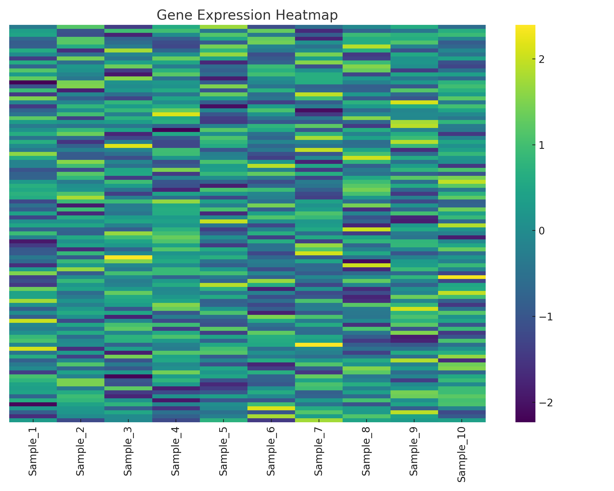
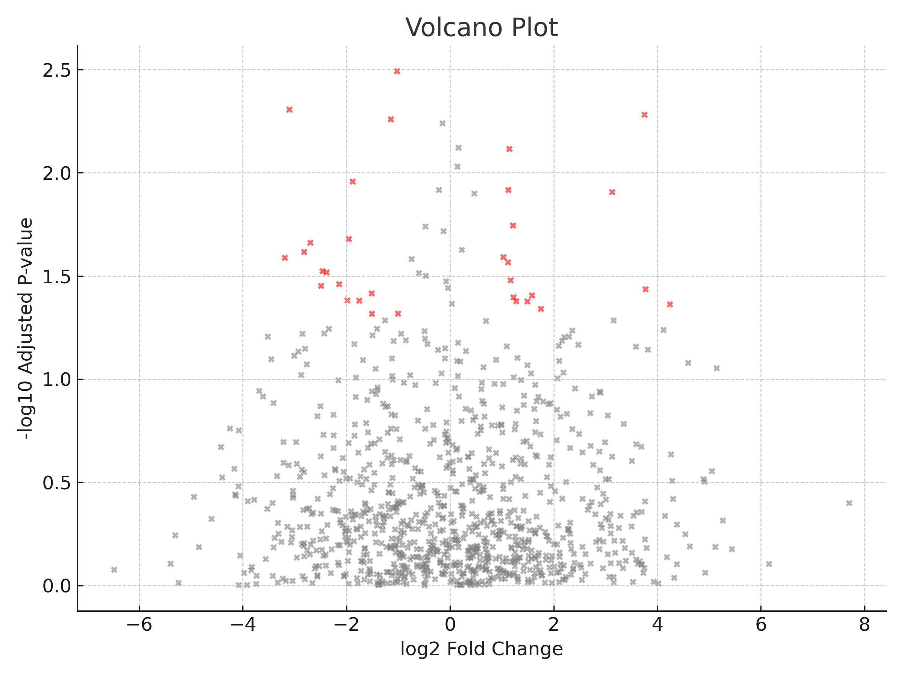

title: "Demo Bioinformatics Analysis"
author: "Somayeh Sarirchi"
date: "`r Sys.Date()`"
output: html_document
---

```{r setup, include=FALSE}
knitr::opts_chunk$set(echo = TRUE)

1. DESeq2 Differential Expression Analysis

source("deseq2/DESeq2_pipeline.R")
head(read.csv("deseq2/DESeq2_results.csv"))

2. Heatmap Visualization

source("heatmap/Heatmap_Template.R")


3. Volcano Plot

source("volcano/volcano_plot.R")


4. VCF Filtering

source("vcf_filtering/VCF_Filtering.R")
head(read.csv("vcf_filtering/vcf_filtered.csv"))

